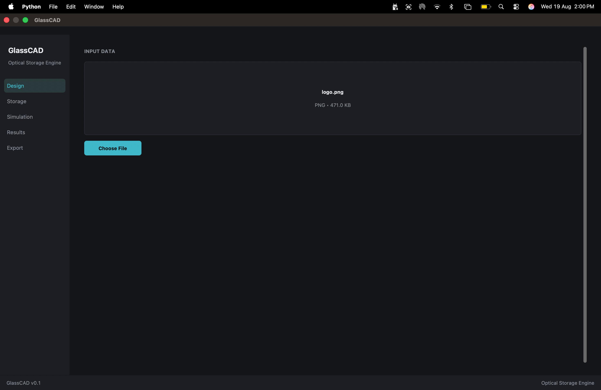
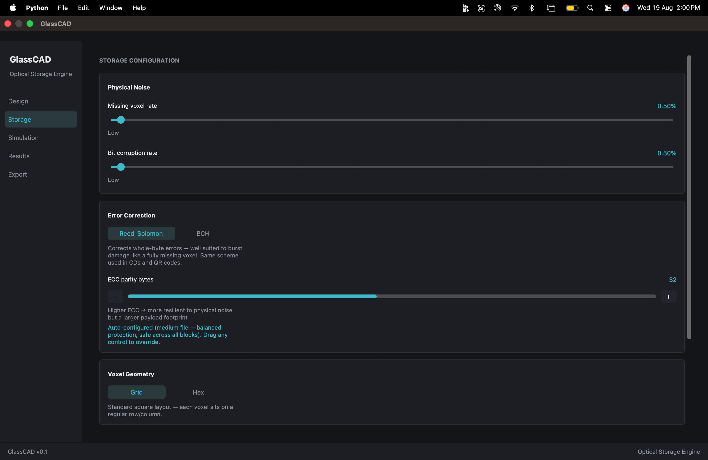
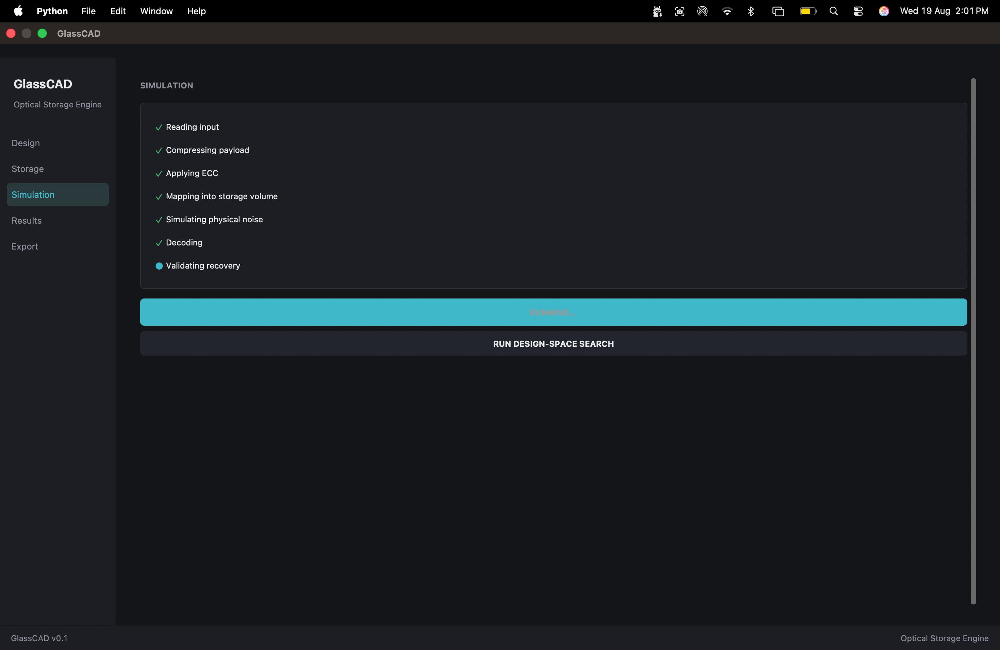
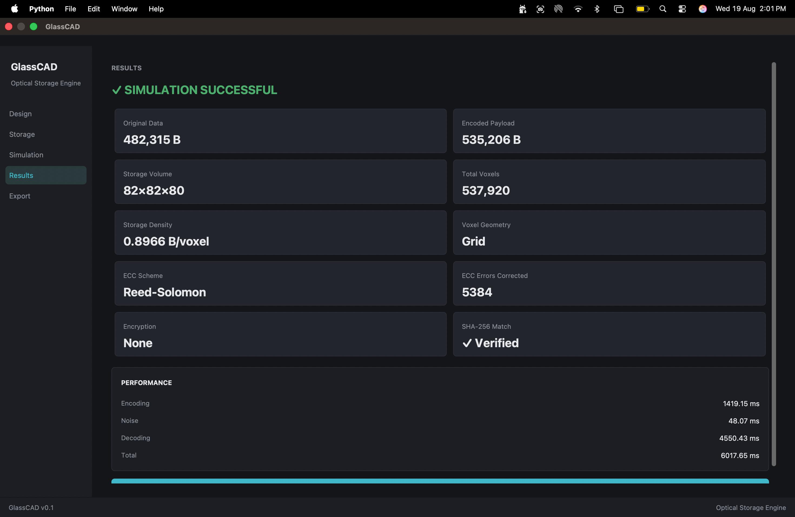
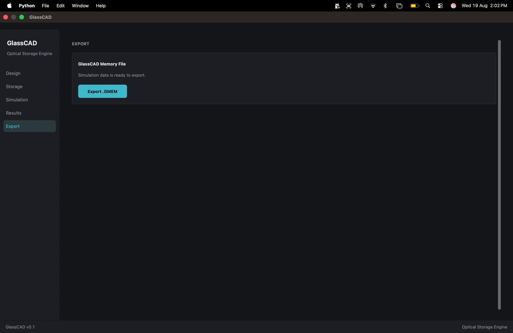
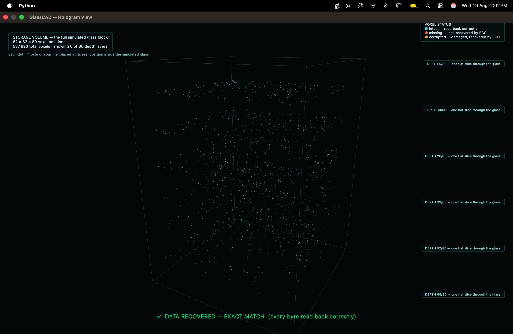

# GlassCAD

**A hardware-agnostic design-automation and simulation platform for volumetric optical glass storage.**

GlassCAD lets you take any file, simulate storing it as a 3D voxel structure inside glass, damage that structure with configurable physical noise, and verify — with cryptographic proof — whether your file can be recovered exactly. It includes a native 3D visualization of the storage volume and an automated design-space benchmark across multiple encoding configurations.

---

## Why this exists

Real volumetric optical glass storage has been physically demonstrated by two major research programs: [Microsoft Project Silica](https://www.microsoft.com/en-us/research/project/project-silica/) (femtosecond laser writing, 10,000-year durability) and the [University of Southampton's 5D optical memory](https://www.southampton.ac.uk/) (nanostructure-based encoding, later commercialized as FemtoEtch). Both systems are physically proven but their software is proprietary and tightly coupled to their own laser hardware — there's no open equivalent of KiCad or SPICE for this domain.

**GlassCAD does not claim to have built physical glass storage.** It's the missing open software layer: a place to design, simulate, and benchmark storage configurations computationally, before any physical fabrication is involved. The `.gmem` output format is intentionally vendor-neutral, so it could in principle target any future physical writing system.

## What it actually does

```
File → Compress → [Optional AES-256 Encryption] → Error Correction →
3D Voxel Mapping → Simulated Physical Noise → Recovery → SHA-256 Verification
```

- **Two error-correction schemes**, both real and independently verified: Reed-Solomon (byte-level correction, used in CDs/QR codes) and BCH (bit-level correction, used in flash memory). Each has genuine, measurable tradeoffs against different noise patterns.
- **Two voxel geometries**: standard grid and hexagonal offset packing.
- **A design-space optimizer** that runs all four geometry × ECC-scheme combinations automatically and ranks them by real, non-fabricated outcomes — success, errors corrected, speed, and density.
- **A native 3D hologram visualization** (PySide6 + ModernGL, no browser) showing the actual voxel data, colored by real status: intact, missing-but-recovered, or corrupted-but-recovered.
- **Cryptographic verification**: every recovery is checked with a SHA-256 hash comparison against the original file, not just a byte-equality claim.

## Screenshots

**1. Design — load any file**


**2. Storage — auto-configured ECC scheme, noise, and geometry**


**3. Simulation — real pipeline stages running**


**4. Results — real recovery stats and SHA-256 verification**


**5. Export — portable, vendor-neutral `.gmem` fabrication file**


**6. Native 3D hologram — real voxel data, colored by real status**


## Getting started

```bash
git clone https://github.com/Darsh-spec/GlassCad.git
cd GlassCad
pip install -r requirements.txt
python gui_app.py
```

Requires Python 3.11. See `SETUP_WINDOWS.md` for a step-by-step Windows setup guide, or run `build.bat` on Windows to produce a standalone `.exe`.

## Project structure

```
core/               # Backend: encoding, ECC, noise simulation, pipeline, optimizer
gui/                # CustomTkinter frontend
gui/hologram/native/ # Native PySide6 + ModernGL 3D visualization
tests/              # Round-trip verification tests
```

## Honest scope — what's not built

This is a software simulation and design tool. There is no physical laser, writer, or optical reader connected to this project. Physical fabrication — a low-cost diode laser writer and camera-based optical reader feeding into the same error-correction code already proven here — is scoped as a distinct future engineering phase, not something this repository currently implements.

## License

*(add your chosen license here — MIT is a common default for open research/student projects)*